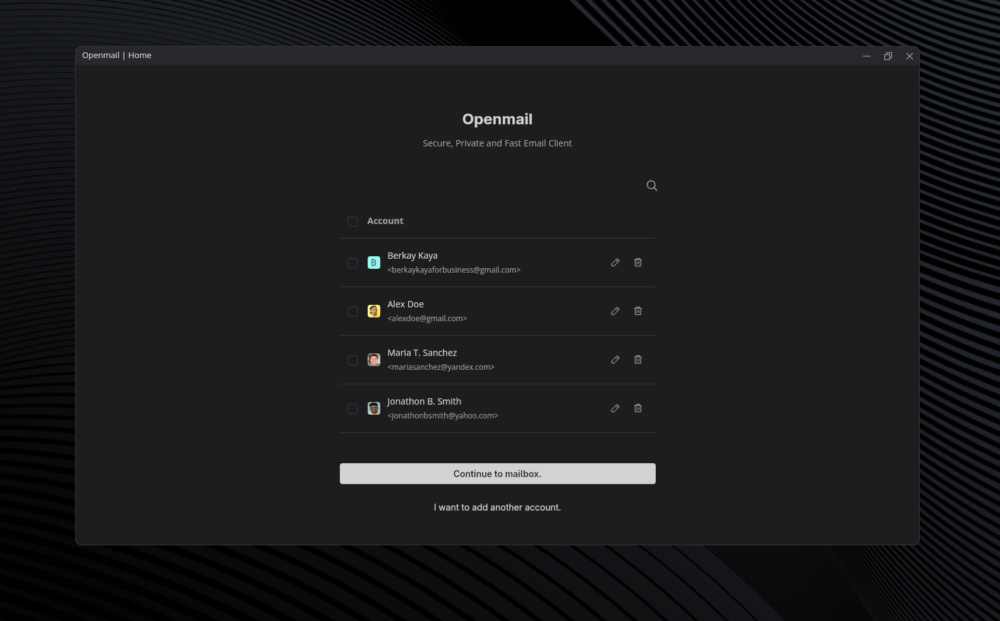
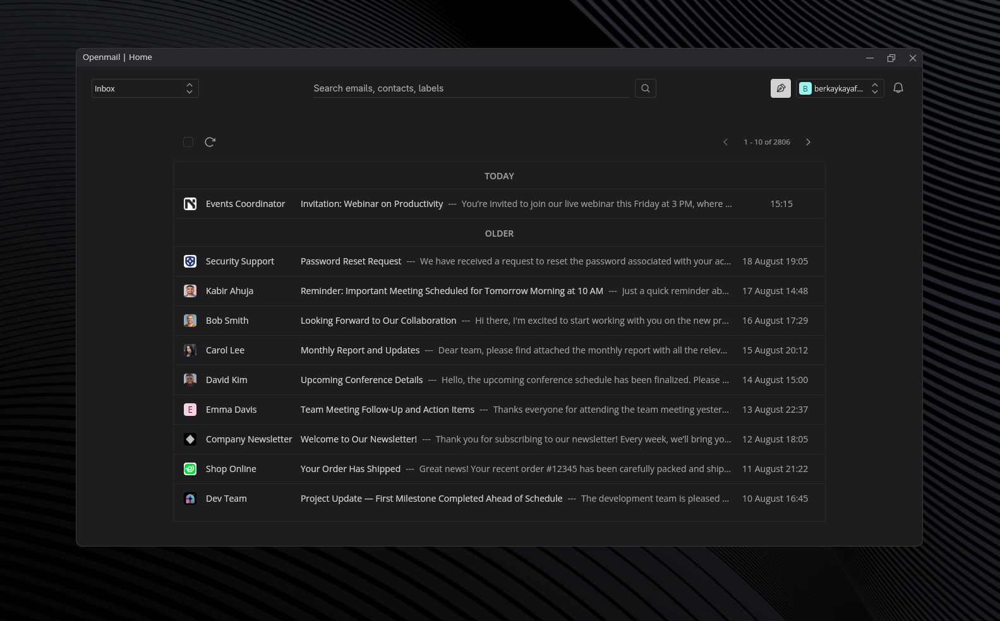
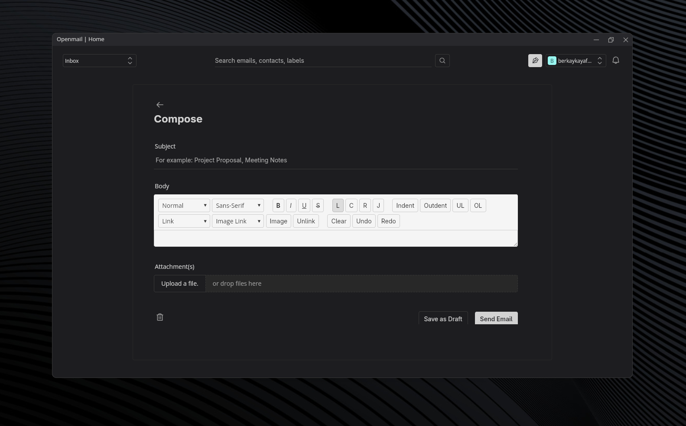
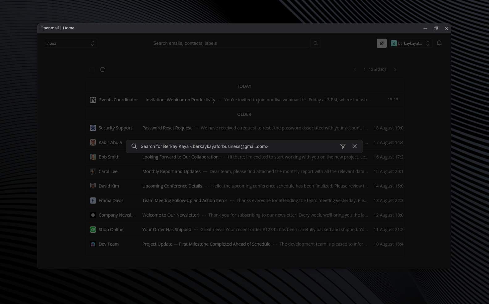
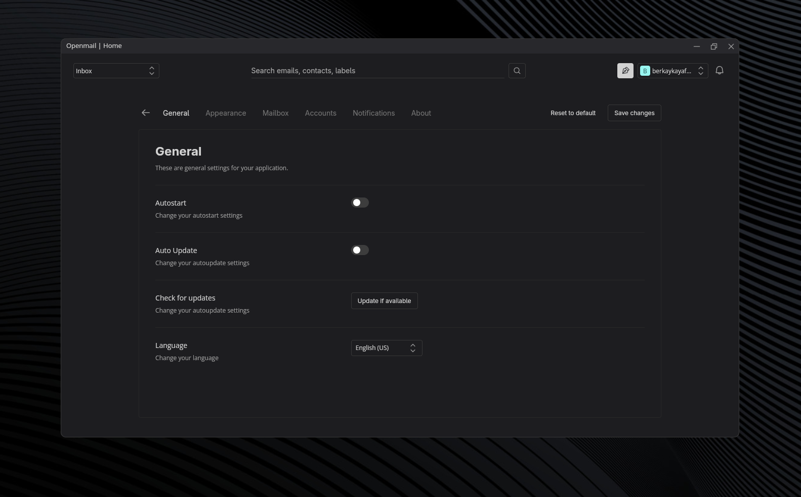
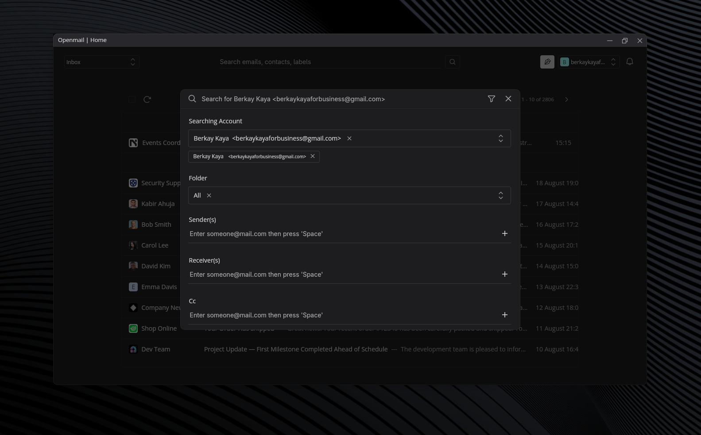

<h1 align="center">Openmail - Self Hosted Email Client</h1>

> This project is still under active development and design. Expect breaking changes.

Private, fast, secure, self hosted email client with latest technologies.

|               |                         |
| :------------------------------------------------------: | :-------------------------------------------------------------: |
|                      _Accounts_                      |                          _Home_                           |
|       |    |
|                      _Compose_                      |                       _Simple Search_                       |
|               |                         |
|                      _Settings_                      |                          _Advanced Search_                           |

> These designs are mostly for testing purposes and are likely to change as development continues.

## Current Features

Some of the features that are already developed.

- **Self-Hosting:** Fully run the client on your own server or local machine — no third-party dependencies for privacy and control.
- **Provider Support:** Compatible with popular email providers (tested with Gmail, Yahoo, Yandex) via IMAP/SMTP.
- **Multiple Accounts:** Connect and manage as many accounts as you need, switching seamlessly between them.
- **Bulk Operations:** Perform bulk actions across multiple accounts at once like archive, delete, mark as read, send, unsubscribe.
- **Unified Inbox:** View and manage new emails from all connected accounts in a single, organized home page.
- **Advanced Search:** Search across all accounts using filters for sender, subject, date, keywords and more...
- **Undo Actions:** Quickly revert recent operations (delete, archive, mark as read) to avoid accidental changes.

## Installation

### Requirements

- [**App:**](app/)
  - Bun
  - Rust (required for Tauri)
- [**Server:**](server/)
  - Python

For detailed setup instructions, see the [Installation Guide](docs/INSTALLATION.md).

## Usage

For step-by-step setup instructions, please refer to the [Usage Guide](docs/USAGE.md).

## Roadmap

Explore upcoming features and plans in the [Roadmap](docs/ROADMAP.md).

## License

This project is licensed under the terms detailed in the [LICENSE](LICENSE) file.

***

<h5 align="center"><a href="mailto:berkaykayaforbusiness@gmail.com">berkaykayaforbusiness@gmail.com</a></h5>
